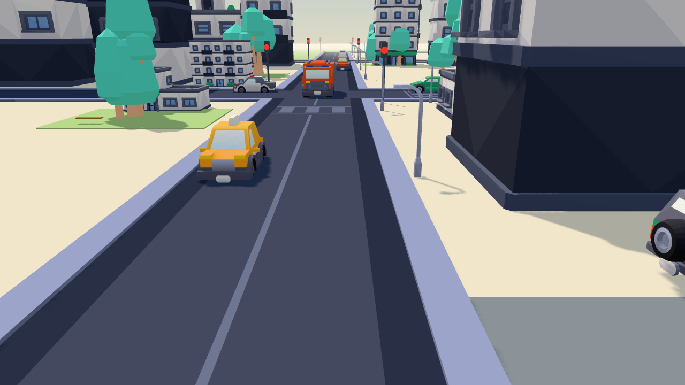

# Kids' Game Platform

A browser game platform for a 4–5 year old, driven by a USB steering wheel.
**Stack:** TypeScript · three.js · Vite. Art: CC0 Kenney kits + a procedural pastel model kit.



## Run it

```
npm install
npm run dev          # → http://localhost:8321
```

The garage at the root is the launcher — big buttons, no reading required.
`npm run build` produces a minified `dist/`; `npm run preview` serves it.

## Controls (Endless City)

WASD / arrow keys or the USB wheel (steering axis + triggers, A = action).
`C` cycles chase / high / cab cameras (or `?cam=high`), `R` resets.
Drive to the 🔥 / 🐱 marker, stop, then sweep the hose or slide the ladder.

## Project layout

| Path | What |
|---|---|
| `src/engine/` | shared engine: pastel palette, stage factory, vertex-color batching (`Baked`), CC0 glTF loader + palette-baker, procedural audio (siren/pump/thud), keyboard + wheel input, dev capture |
| `src/kit/` | procedural model kit by family (nature, people, buildings, vehicles, animals, props) |
| `src/worlds/` | parametric generators: city street, valley, railroad, and the endless-city **chunk generator** |
| `src/games/city/` | the playable game, one module per concern: player physics, chunk streaming, traffic + working traffic lights, missions, spray + ladder mini-scenes, particles, save state |
| `src/games/registry.ts` | the list of games the launcher renders |
| `src/games/diorama/` | the three concept dioramas, now proper modules |
| `public/assets/kenney/` | CC0 Kenney models (Car Kit, City Kit, Nature Kit) + licenses |
| `docs/engine-notes.md` | engine decision record, measured perf, wheel plan |

## Conventions

- **Deterministic worlds**: every generator is a pure function of a seed — seed 7 is seed 7 forever, so the kid can revisit "their" city and seeds can be shared as links.
- **One draw call per city chunk**: Kenney models are baked per-face into vertex-colored merged geometry by `src/engine/assets.ts` (see `bakeTemplate`). If an asset fails to load, the procedural fallback kicks in — the game never breaks.
- **Adding a game**: one entry in `src/games/registry.ts` + one rollup input in `vite.config.ts`.
- **Captures** (docs/screenshots): load any page with `?still=1&capture=name.png` — the frame lands in `concept-art/` via the dev-server middleware.

See [docs/engine-notes.md](docs/engine-notes.md) for the engine decision record and measured performance.
