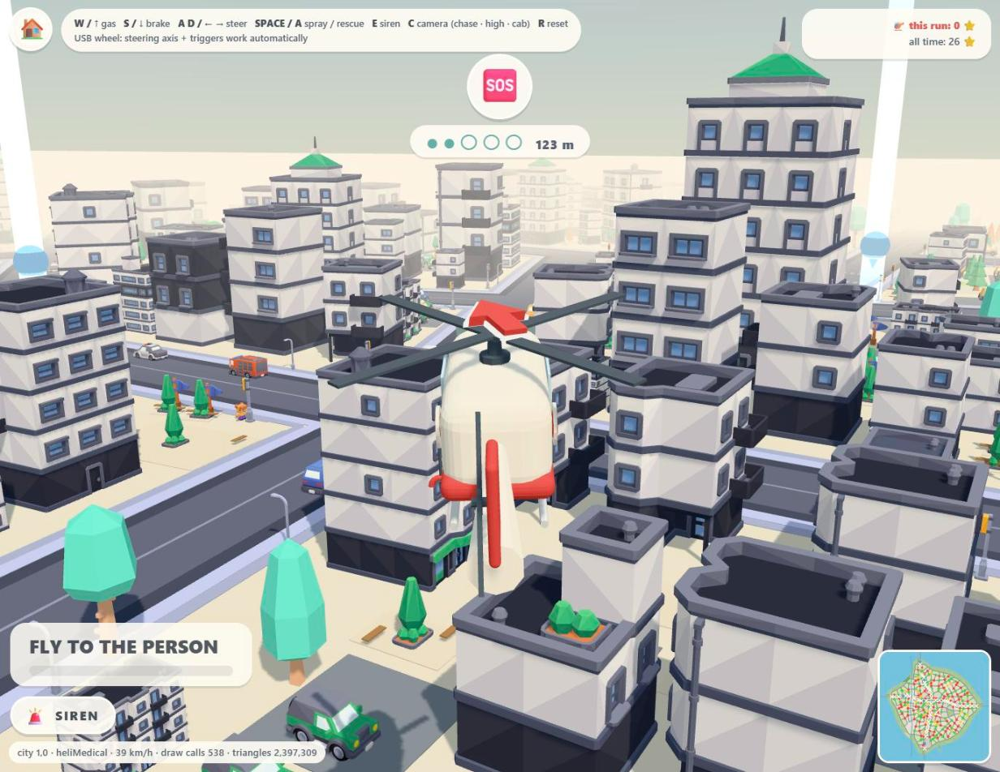
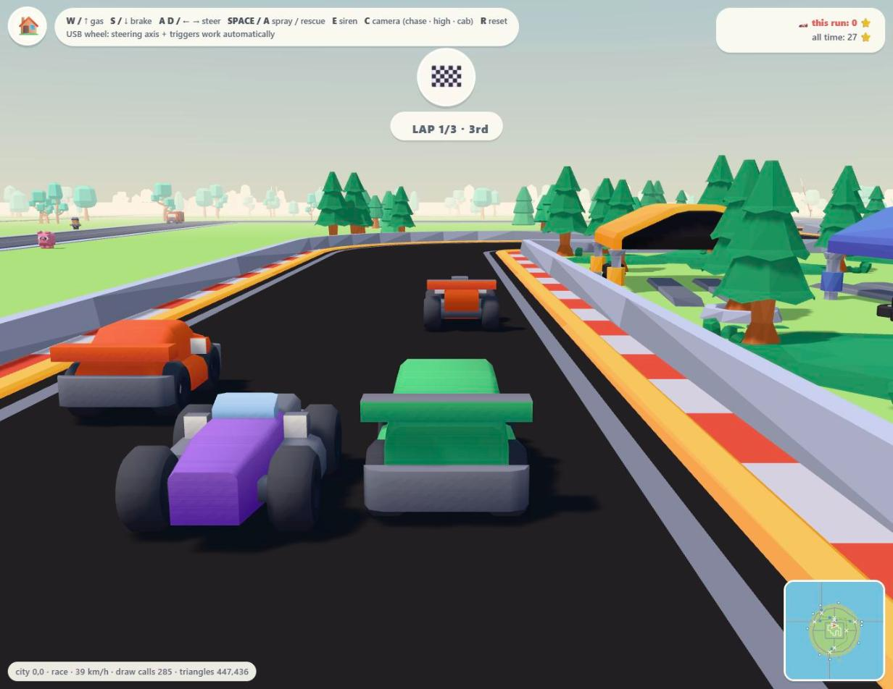
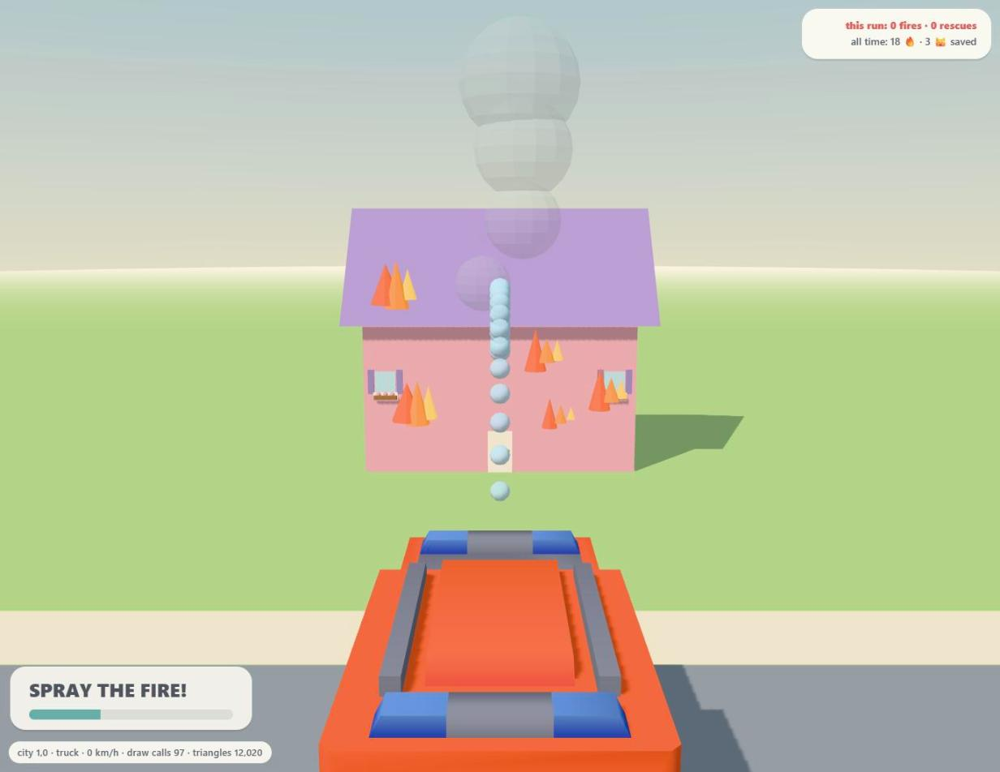
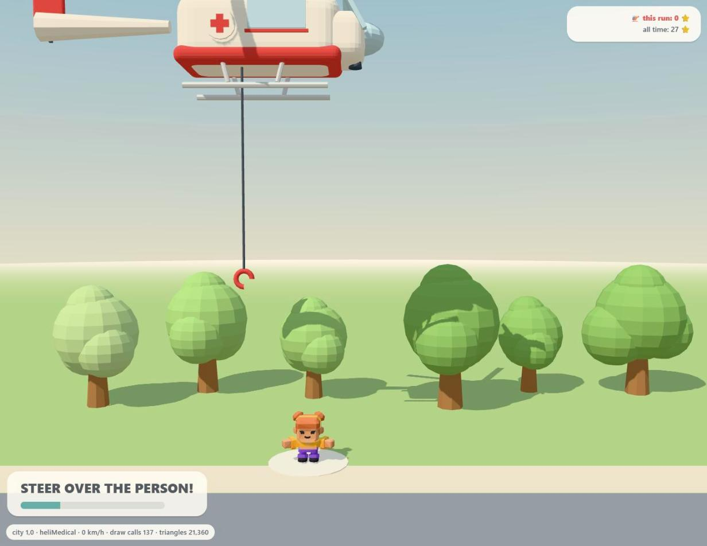

# Kids' Game Platform — Endless City

A browser driving game for a 4–5 year old, played with a USB steering wheel
(keyboard and mouse work too). No reading needed: every choice is made by
turning the wheel and pressing the pedal, and the names are spoken aloud.
It speaks **Portuguese (Portugal)** by default, or **English**.

**Stack:** TypeScript · three.js · Vite. **Art:** CC0 [Kenney](https://kenney.nl)
kits plus a procedural pastel model kit.


## What it is

**Endless City** is an endless archipelago of island cities joined by
causeways. Each island is grown from a seed. It has its own shoreline, a
river, two railway lines with stations and gated level crossings, and a
street web at many angles. Its districts run from downtown towers out to
suburbs, parks, forests and rail yards. Every tenth island in each direction
is a small race island that is a whole kart circuit.

The world keeps running while you play:
- cars follow the streets and stop at red lights;
- people and pets walk the sidewalks and cross at the corners;
- trains run on a timetable from island to island;
- boats sail under the causeways' raised spans.

Nobody can be run over, and a bump never ends the game: the vehicle flashes
and carries on from a spot just behind.

### The nine play modes

| Mode | What the kid does |
|---|---|
| 🚒 Fire truck | Drive to fires and cats in trees; spray the hose, raise the ladder |
| 🚓 Police car | Chase the getaway cars — bump one and it dashes off; stay right behind it to catch it |
| 🚑 Ambulance | Drive to people who need help and steer the stretcher into the ambulance |
| 🚁 Rescue helicopter | Fly to the call, hover over it and winch the person up |
| 🚁 Police helicopter | Keep the getaway car in the searchlight |
| ✈️ Plane | Swoop through sky rings (it can't stall or crash) |
| 🚤 Boat | Sail round the island through the buoys |
| 🚆 Train | Drive the train and stop at the yellow STOP board — passengers get on and off |
| 🏎️ Kart race | Three laps against three AI karts on a race island |

| | |
|---|---|
|  |  |
|  |  |
|  |  |

Reaching a call opens its **mission scene**. The wheel is the only input
there: sweep the hose over the flames, slide the ladder to the cat, or hold
the winch hook over the person.



## How to play

1. Open the game. The **garage** shows the vehicles on a turntable.
2. **Turn the wheel** to spin the carousel (keep it turned to keep stepping).
3. **Press the pedal** (or any wheel button, Enter, or click **GO!**) to start.
4. Follow the **arrow over the vehicle**. The badge at the top shows what the
   call is and how far away it is. The arrow swings into a turn well before
   the junction.
5. At the call, stop (or hover, in a helicopter) and its scene opens.

Back to the garage: the 🏠 button, **Esc**, or hold the wheel's start/select
button for a second.

### Language

The game is in **Portuguese (Portugal)** by default. To switch to English
(or back), click **Português / English** under the stars at the top right of
the garage, or press **L**. The choice is remembered for every page. For one
visit only, add `?lang=en` or `?lang=pt` to the address.

The names are spoken in the chosen language by recorded voices (a
Portugal Portuguese one and a British English one), so every computer
sounds the same, whatever voices it has installed. The clips are in
`public/audio/voice/`.

To re-record them after changing a text, you need Python 3.10+,
`pip install piper-tts` and ffmpeg. Then run `python tools/make-voice.py`.
It downloads the two [Piper](https://github.com/OHF-Voice/piper1-gpl)
voices (~63 MB each) into `.voices/` once, and records only the lines that
changed. `npx tsx tools/check-i18n.ts` fails if a clip is missing or out of
date.

### Controls

| Action | USB wheel | Keyboard |
|---|---|---|
| Steer | wheel | `A` / `D` or ← / → |
| Gas / brake (reverse) | right / left pedal (triggers) | `W` / `S` or ↑ / ↓ |
| Spray / rescue | the A button | `Space` |
| Siren | — | `E` (or the SIREN button) |
| Camera: chase / high / cab | — | `C` |
| Reset | — | `R` |

In mission scenes only steering counts (the wheel, `A`/`D`, or the mouse's
x position).

### Useful URL options

The game page is `play/city.html`.

| Option | Effect |
|---|---|
| `?mode=truck\|police\|ambulance\|heliMedical\|heliPolice\|plane\|boat\|train\|race` | pick the play mode directly |
| `?seed=N` | replay a world exactly (every new game rolls a fresh seed and writes it into the URL) |
| `?lang=pt\|en` | Portuguese or English for this visit |
| `?cam=high` | start with the high camera |
| `?scene=fire\|cat\|rescue\|patient\|caught` | open a mission scene straight away |
| `?noworker=1`, `?noprefetch=1` | build islands on the main thread / on demand (for comparison) |
| `?debugsea=1` | expose `window.__dbg` for debugging and automated checks |

## Run it

You need [Node.js](https://nodejs.org) 20.19+ or 22.12+ (what Vite 7 requires).

```sh
git clone https://github.com/jsantos98/kids-platform.git
cd kids-platform
npm install
npm run dev            # → http://localhost:8321
```

## Build it

```sh
npm run build          # typecheck (src + tools) and a minified build in dist/
npm run preview        # serve dist/ on http://localhost:8321
```

`dist/` is a static site: copy it to any static web host. It uses relative
paths, so it also works from a sub-folder.

## Checks

The world generator is a stack of hard rules (streets, railway, river,
coast, traffic…). They are listed in [AGENTS.md](AGENTS.md) with the code or
check that enforces each one. Before changing world or traffic code, run:

```sh
npm run typecheck
npx tsx tools/audit-world.ts 7        # every world rule, for one seed (try several)
npx tsx tools/check-walkers.ts        # nobody can be run over
npx tsx tools/check-traffic.ts        # the traffic never jams
npx tsx tools/check-i18n.ts           # every text is translated
npx tsx tools/plan-hash.ts            # for refactors: the cities must not change
```

## Project layout

| Path | What |
|---|---|
| `index.html`, `src/main.ts` | the garage (launcher) |
| `play/city.html`, `src/games/city/` | the game: modes, player physics, missions, guide arrow, robbers, race, trains, sea, HUD, loading |
| `src/games/city/activity/` | the mission scenes (hose, cat ladder, rescue ladder, stretcher, winch, caught) |
| `src/games/city/island/` | each island's traffic and walkers |
| `src/worlds/` | the world generators: coast, streets, rail, river, blocks and lots, occupancy grid, chunk baking, and the world and chunk workers |
| `src/engine/` | shared engine: palette, stage, vertex-colour batching, Kenney model loader, audio, wheel and keyboard input |
| `src/kit/` | the procedural model kit (vehicles, people, animals, buildings, nature, props) |
| `src/i18n/` | every visible text, in English (`en.ts`, which defines the keys) and Portuguese (`pt.ts`) |
| `src/games/diorama/`, `diorama/` | the three early concept dioramas |
| `public/assets/kenney/` | the CC0 Kenney kits, with their licence files |
| `tools/` | the audit and check scripts |
| `AGENTS.md` | the world and gameplay rules — read it before touching world code |
| `docs/engine-notes.md` | the engine decision record and measured performance |

## Credits

3D models: [Kenney](https://kenney.nl) — Car Kit, City Kit (Commercial,
Industrial, Suburban, Roads), Nature Kit, Mini Forest, Survival Kit, Cube
Pets, Mini Characters, Train Kit, Watercraft Kit, Toy Car Kit and Racing
Kit, all CC0. The licence files are in `public/assets/kenney/` (the Racing Kit's in its own folder).

Voices: recorded with [Piper](https://github.com/OHF-Voice/piper1-gpl) using
[`pt_PT-tugão-medium`](https://huggingface.co/rhasspy/piper-voices/tree/main/pt/pt_PT/tug%C3%A3o/medium)
(dataset CC0; fine-tuned from Piper's US-English "lessac" voice, whose
recordings are licensed for non-commercial use) and
[`en_GB-cori-medium`](https://huggingface.co/rhasspy/piper-voices/tree/main/en/en_GB/cori/medium)
(LibriVox recordings, public domain).
