# Endless City — history

How the game has grown, newest first. Each entry has the screenshots as the
game looked that day; the [README](../README.md) always shows the latest.

---

## 2026-10-10 (even later) — a level below Low, for the slowest laptops

The lowest graphics level was still too much for a laptop with a slow
processor: even with the picture shrunk, the game could only reach 18 frames
a second there. There is now a fourth level, **Minimal** (graphics ⚙️ →
*mínimos*): no shadows, a shorter view of the city, fewer cars and people
drawn and a small picture — about half the drawing work of Low (203 draw calls
and 0.76 million triangles a frame against 446 and 1.7 million), so it looks
plainer and plays much faster. Automatic steps down to it by itself when Low
is still too slow. In the plane and the helicopters the city is now drawn two
chunks further at every level (a longer view over the island: the rings and
calls are a long way off), which on the slowest levels costs about what one
level up used to. The status line also shows how many milliseconds of the
processor each frame takes (`cpu N ms`), so one look says whether the
processor or the graphics chip is the limit.

---

## 2026-10-10 (later) — a bigger screen costs no more

On a small laptop with a full-HD screen the game ran at half the speed it
did on an older one with a smaller screen, even on the lowest graphics: the
picture was drawn at a fixed share of the screen's pixels, so a bigger screen
meant twice the work. Every graphics level now has a pixel budget (low 0.7
million, medium 1.4 million, high 3.2 million), so a bigger screen is drawn
smaller and scaled up, and a small screen looks exactly as before. The status
line at the bottom-left now also shows the picture's size and the name of the
graphics chip (and warns if the browser has fallen back to software
rendering, the usual reason for a few frames a second).

---

## 2026-10-10 — the steering wheel, set up in a minute

**A wheel page.** Plug the wheel in, open the garage's ⚙️ settings and
choose *Volante*: a page shows everything the wheel sends, live (every axis
as a bar, every button as a dot), says which wheel is connected, and walks
through a short calibration — let go, wheel left, wheel right, gas pedal, brake
pedal — that works out which control is which and saves it for the game. It
copes with whatever the wheel does: pedals as buttons or as axes, gas and
brake on one axis, steering the other way round. Before, the game guessed one
layout, and a wheel whose pedals were axes (like the one it was first tried
on) had no working pedals.

**Buttons with jobs.** The same page gives the wheel's buttons jobs: accelerate
and brake (for a child who doesn't take to the pedals), the siren, the camera,
sounds and music on / off, back to the start of the drive, go and back to the
garage — as many buttons as you like for each action, one job per button, kept
when you recalibrate. Back to the garage is a simple press.

**Easier in the garage.** The carousel now moves on a small turn of the wheel
(about 15 % of its lock instead of 45 %).

---

## 2026-10-08 — auto speed, airports, an eight-car race and a car just to drive

**Auto speed.** A new setting in the garage's ⚙️ panel, off unless a grown-up
turns it on. With it on, the game presses the gas and the child only steers.
The fire truck, ambulance, tow truck, garbage truck and rescue helicopter
drive at a gentle pace and stop by themselves at each call or delivery, so
the mission opens. The chases, the courses, the race and the plane keep
speeding. The train is still driven by hand: stopping at the station is the
child's job. The pedals always win over it, and it never reverses on its own.

**Every bump is a crash.** Before, touching a wall slowly only scraped and
the city's cars only pushed, so a car could get wedged with no way out. Now
any bump — a wall, a pole, a parked or moving car, the water's edge, a
bridge's side, the race track's wall — flashes the car, the narrator says
"oops", and it is put back on a clear lane, ready to go.

**Airports.** Every island has a small airport on its own island off one of
its corners, joined to the shore by a causeway (like Singapore's Changi):
a runway with lights for the night, a terminal, a control tower, a hangar,
a windsock and planes at the gates; the airport is on the map. Landing is
flown by the child: point the plane down a runway — or just fly over it —
and it starts to come down a gentle glide. The map marks the airport of
the island below with a 🛬 and draws the runway's line dotted out from both
ends, to line up with. The child steers it in the whole way and can call it off any time by
steering away or pressing the gas; the plane climbs back up. Close to the
ground it eases onto the runway's line, so a plane a little off still lands.
Once on the runway it stops (by itself with auto speed), turns round on the
spot and takes off again. (The first version took the plane over and flew it
in like a magnet, and flying over the runway did nothing at all: both fixed.)

**The race has eight cars**, and the child starts at the back of a
staggered grid. The rivals keep out of each other's way, and the faster the
child drives, the better the place: about 4th at an average pace, first when
driving well.

**A car just to drive** — the first in the garage: no missions, no arrow,
anywhere on the islands.

**Calls on every island.** Flying (or driving) to another island used to
leave the old island's calls behind — they still counted as the three
active ones, so no new calls appeared and the arrow pointed 3 km back home.
Now each island has its own calls: crossing to a new island clears the old
ones, and the first new call appears close ahead.

**Any time of day.** A new game now starts at a random time of day (morning,
noon, dusk, night…) instead of always at 8:00. The time is written into the
address like the world's seed, so refreshing or sharing the page replays the
same moment.

**Steering is easy.** The fire truck (and every other vehicle) needed the
turn planned well ahead: at full speed it turned in a circle 13 m wide, and
it barely turned at all from a crawl. Now every road vehicle turns in a tight
circle (the truck 5–6 m) at any speed, and even standing still swings round
a little; boats, the helicopter and the plane turn much more sharply too, and
the steering eases in smoothly. On top of that, a road vehicle whose wheel is
let go eases itself onto the street it is nearly along: let go half way round
a corner and it finishes the turn by itself, and a vehicle drifting
sideways straightens up. Steering by the child always takes over at once.

**No more flicker.** Surfaces lying in the same plane (z-fighting) flickered
in many places. The depth buffer is now a reversed float one, which keeps
its precision to the horizon (thin layers like road over gutter, grass over
beach, and the windows on buildings no longer shimmer from far away), and the
places where two surfaces were exactly level were separated: the river's
water against the green yards, its bank against its footpath, the pavements
against the railway's sleepers at level crossings, the white surf foam
against every causeway, the picnic bridge and the airport's causeway where
they meet the beach, and the rail crossing's bed against the kerbs. A new
check scans every island's ground for any two surfaces level with each other.

| | |
|---|---|
| 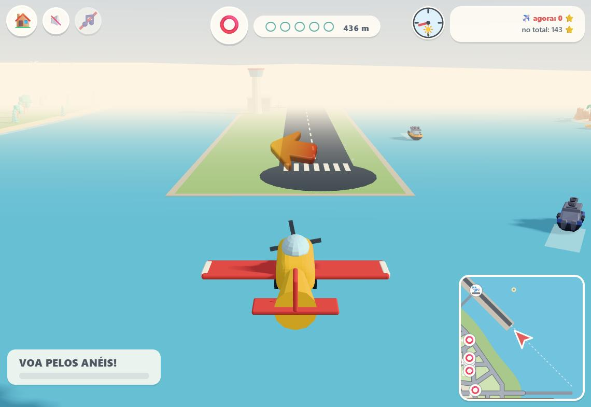 | 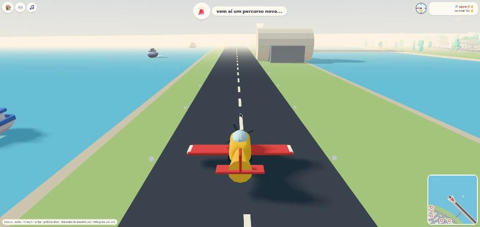 |
| 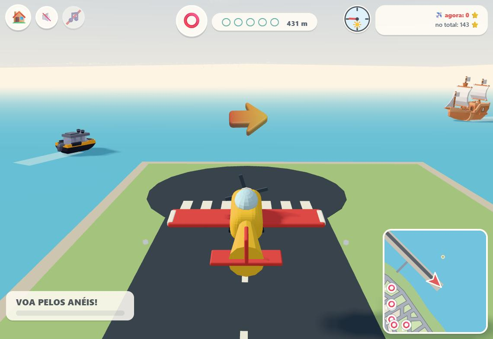 | 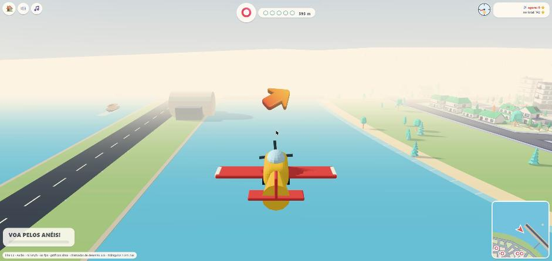 |
| 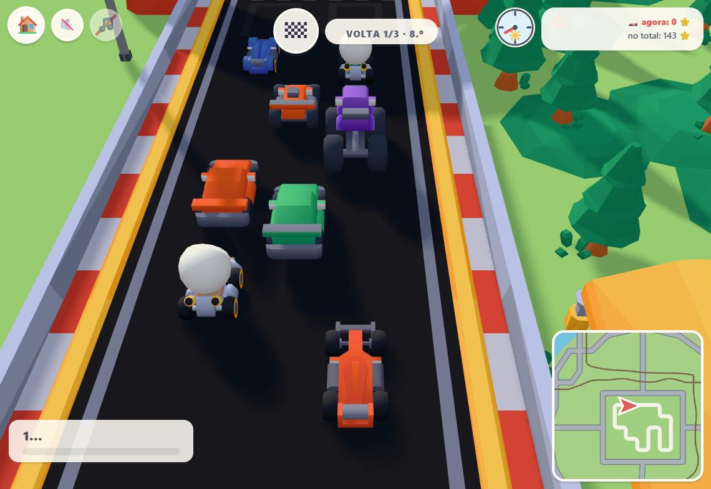 | 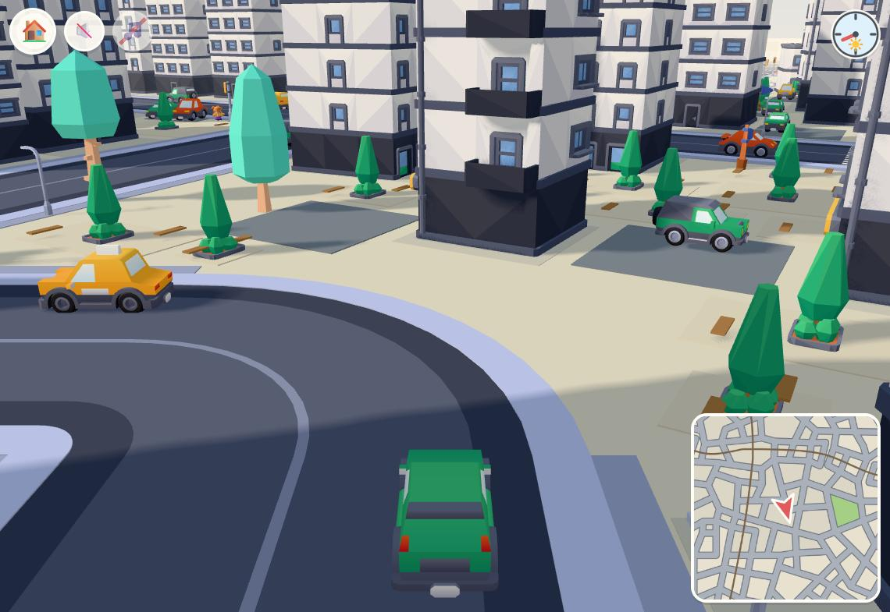 |
| 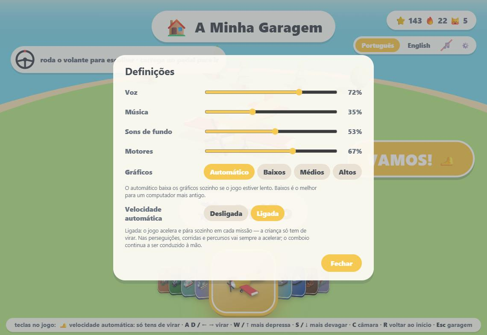 | |

---

## 2026-09-30 (later) — the train's doors get their own scene

The doors game now plays like every other mission: when the train stops at
a platform, the view fades into the station. The kid turns the wheel right
and the doors slide open. The people get off and walk away, and the queue
(a dog or a cat among them sometimes) walks in one by one. Now and then
someone comes running late and everybody waits for them. When everyone is
aboard the bell rings; the kid turns the wheel left, the doors close, the
guard waves and the train eases forward. Then it fades back to the world
and the train can go on.

In the pirate ship, the treasure is never a long sail away any more.
Every corner of an island now has its treasure islets, the ships to catch
sail near them, and the map marks the nearest islet. Before, after sinking a
ship the treasure could be a kilometre off.

| |
|---|
| 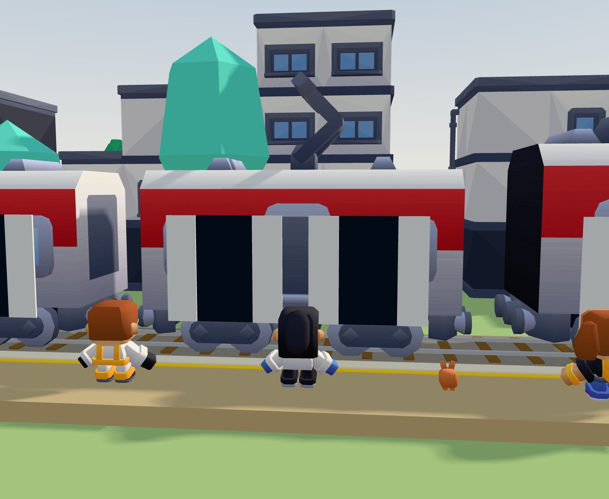 |

---

## 2026-09-30 — the train: clear platforms, safe crossings, and doors to open

**The station roofs no longer cut into the train.** The platform canopy
reached out over the track, and every train drove through it, the STOP board
and the posts. The platform now starts further from the track and its roof
covers only the platform, clear of the widest train in the game. A new check
measures every train model and holds the platforms clear.

**No more cars in front of the train.** The level crossings only started to
close as the kid's train moved off, and cars could still turn into a crossing
that was already closing. Now:
- the crossings see the train coming, from its real front;
- pulling away near a crossing, the train waits a moment while the booms come
  down, and sounds its horn;
- a car won't turn into a street whose crossing is closing;
- if someone is still on a crossing ahead, the train waits and toots.

A new check drives the kid's train through the city's traffic and fails if
anyone is on a crossing as the train reaches it.

**Stopping is easier, and the doors are the kid's job.** A stop counts
anywhere along the platform, even well past the STOP board. Then the kid
turns the wheel right and the doors slide open. The people get off and on.
When everyone is aboard a bell rings, and turning the wheel left closes the
doors: a star, and off we go. The train won't move while the doors are open,
and if nobody turns the wheel the doors move by themselves after a while.

| | |
|---|---|
| 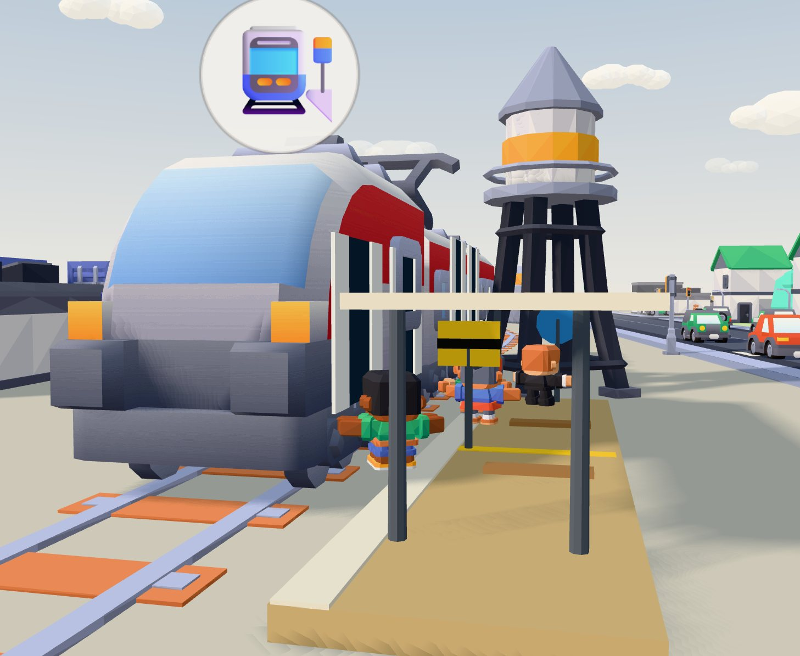 | 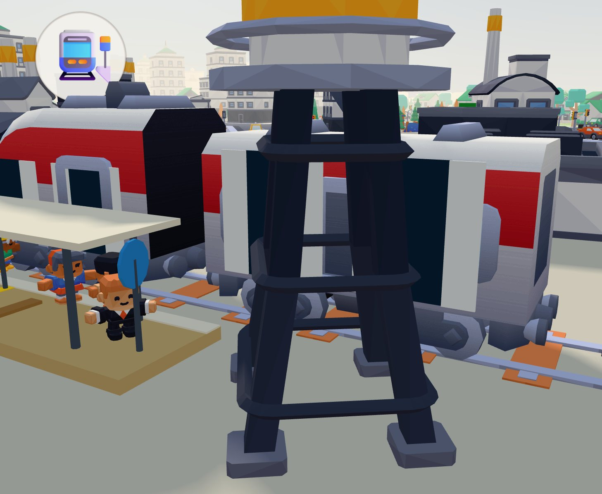 |

---

## 2026-09-30 (morning) — after the kid tried the new modes

A round of fixes after the first rides:
- **The garbage truck** no longer carries a floating box under its arrow.
  Its amber beacon is now a small dome on the cab roof, lit only while it
  has a load.
- **Its bins game** fits any screen. On a narrow window, two of the four
  bins used to be out of view.
- **The police boat's lights** sit on the back of its cabin, as in the
  pull-over scene. Before, the game mistook a blue fitting on the hull for
  its lamp.
- **At night every siren glows:** the lit lamp throws a big red or blue
  light on the street or the water around it, on the beat of the flashing.
- **Nobody appears from nowhere at a handover:** the nurse, police officer
  or mechanic comes out of the door to the vehicle, and walks back in with
  the patient, thief or pirates.

| | |
|---|---|
| 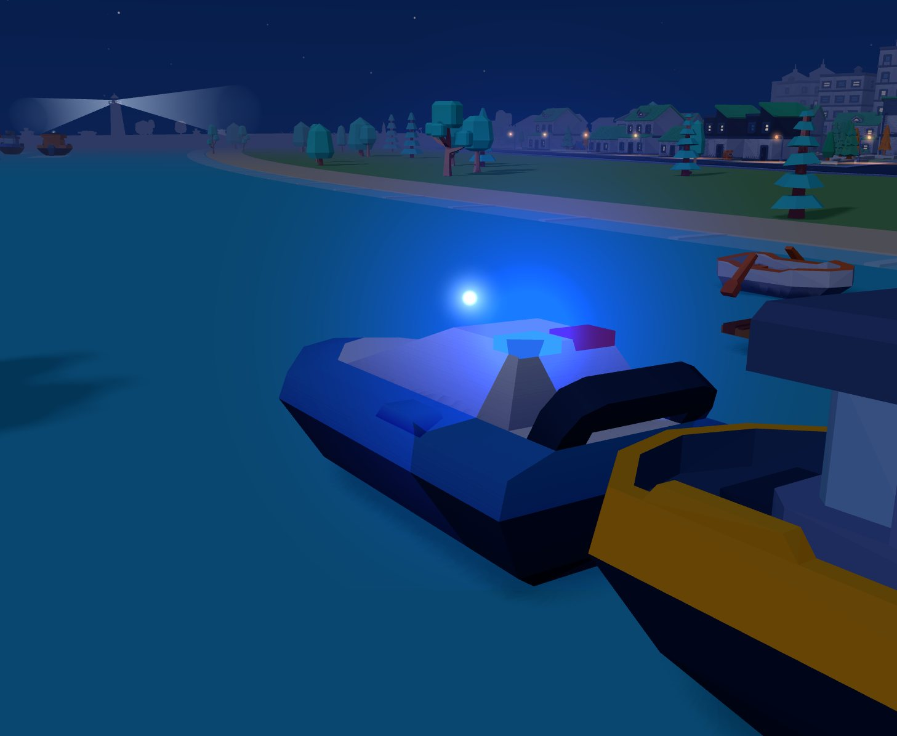 | 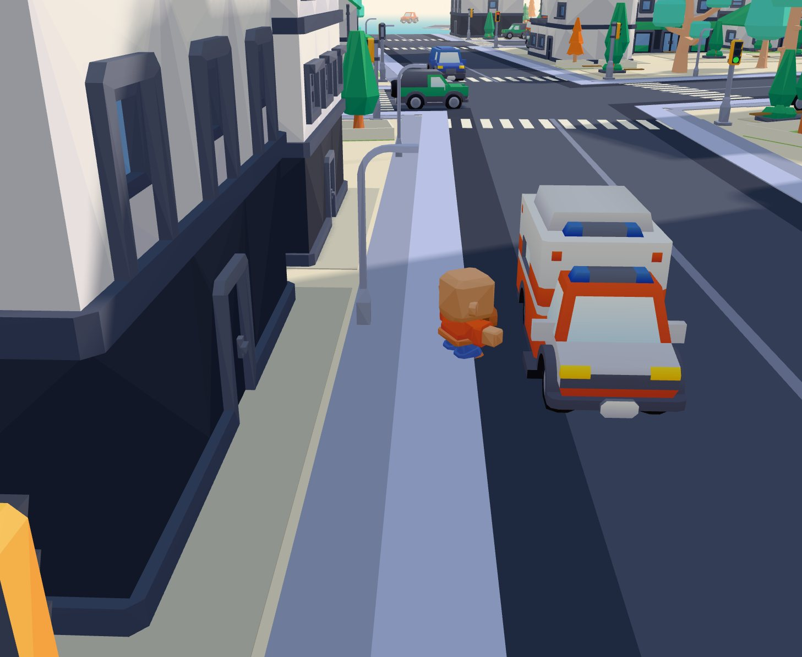 |

---

## 2026-09-29 (evening) — somewhere to take them: hospitals, a prison, two work trucks and a police boat

**Everyone goes somewhere now.** Every island has hospitals, a prison, repair
shops, a recycling depot and a police pier. They are real buildings the city
already had, with a sign over the door (a red cross, 🚔, 🔧, ♻️), and a
helipad on each hospital's roof. After the stretcher run the ambulance takes the
patient to the nearest hospital, and the other patients wait (their call
icons go pale) until it's been. The rescue helicopter lands on the hospital's
roof. The police car takes the robber it caught to the prison. Arriving, the
crew walk them in, and that's the star.

**Two new games: the tow truck and the garbage truck**, both trucks that
already drive in the city's traffic.
- *The tow truck* (the red flatbed) finds cars broken down on street corners:
  bonnet up, hazard lamps blinking, the driver waving. It backs up, drops its
  ramps and winches the car up. The car's flat tyre keeps pulling it to one
  side, and the wheel keeps it in line. The car then rides on the truck to a
  repair shop.
- *The garbage truck* drives to full bins. Its side grabber takes each bin
  the kid stops at, lifts it over the truck and tips it in, with bags,
  bottles and cans tumbling. After three stops the truck is full and goes to
  the recycling depot.

**Another new game: the police boat.** It chases speedboats racing and
weaving where they shouldn't, and the pirate ship. Catch one and it's a chase
down the waves: stay in its wake until it gives up, then bring the crew to
the police pier.

All the new lines are recorded, in both languages. The Portuguese ones still
need picking by ear.

| | |
|---|---|
| 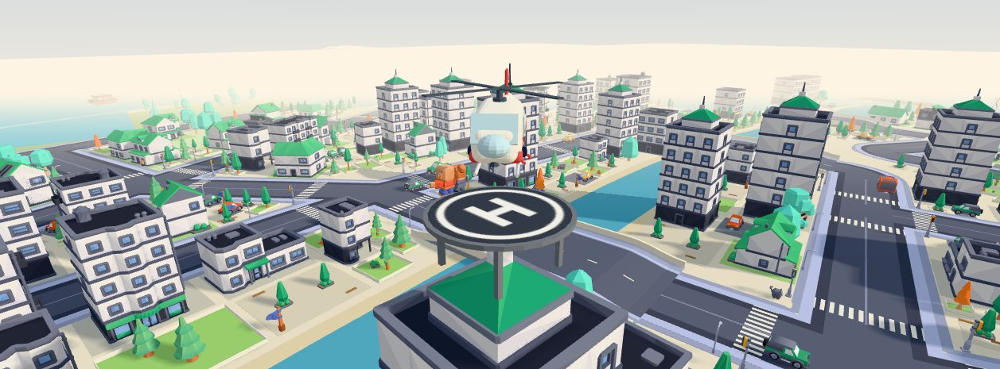 | 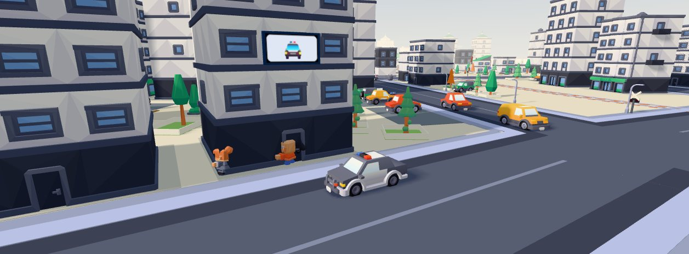 |
| 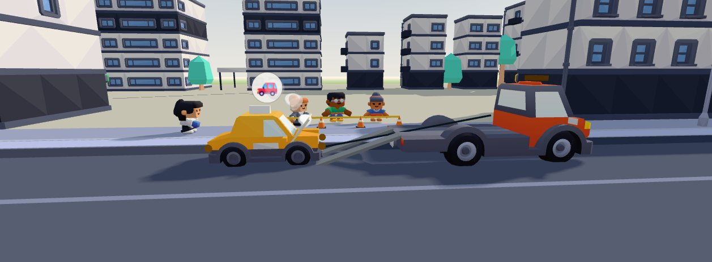 | 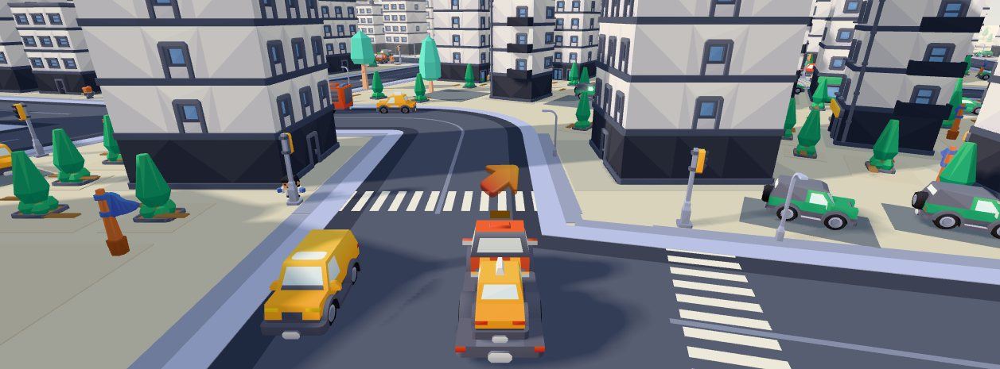 |
| 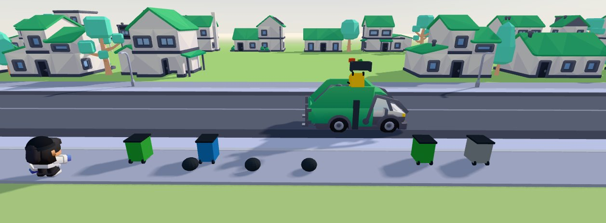 | 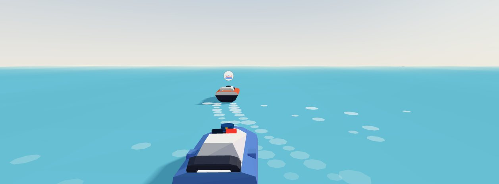 |

---

## 2026-09-29 (later) — after the first voyage

The kid tried the pirate ship and we fixed what came up. The next ship to catch
is always near now: they put out a few hundred metres from the pirate ship, a
beaten one comes back close by, and if the pirate sails off they follow. The
ship no longer sticks in the pier — its bow and stern bump too, not just its
middle, it can always back out, and holding the gas while going nowhere puts
it back on clear water. The sea is twice as busy: some sixty-five boats round
every island, two big ships on every loop, and little boats circling the
treasure islands. And every vehicle tilts the right way: speeding up heading
east or west, the ship (and the helicopter, the plane, a car on a causeway
ramp) used to lean to the side instead of lifting its bow. The new pirate lines
were picked by ear.

| | |
|---|---|
| 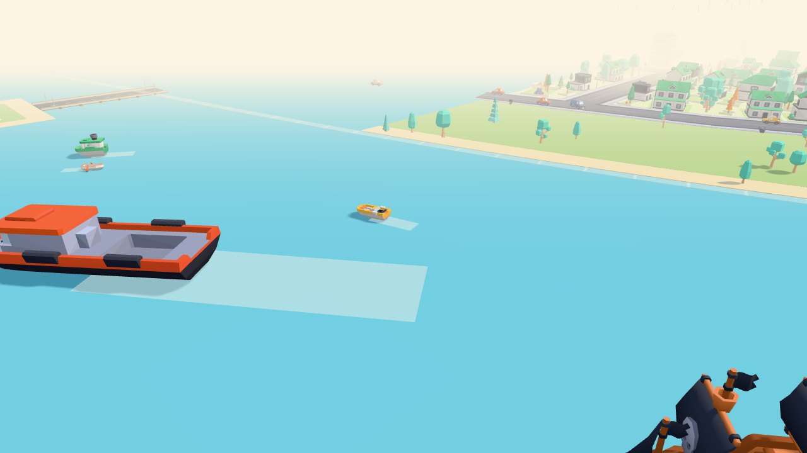 | 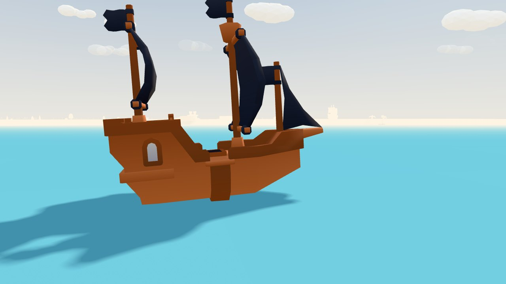 |

---

## 2026-09-29 — pirates, a busy sea, and trains that stop

**A new game: the pirate ship.** The kid sails a pirate ship with black sails
on the same sea as everyone else. Out on the open water sail a rival pirate
ship and two merchant ships with white flags; they run when the pirate comes
near (and so do the island's own boats), but the pirate ship is faster. Catch
one and a sea battle starts: on the pirate's deck the wheel swings the cannon,
which fires by itself, and the kid keeps it on the other ship as it sails to
and fro. The rival pirate ship goes down in a cartoon sinking, its crew rowing
off in little boats, waving; the merchant raises its white flag and swings a
chest of gold across. Either way a treasure map floats up. The map marks one
of the little treasure islands out at sea (a 💰 floats over it); stop beside it
and the captain goes ashore with a treasure detector that beeps faster the
nearer the treasure is, and digs the chest up. It sails to two new sea
shanties, the ship creaks and the cannons boom, a parrot squawks, and the
narrator has new lines for all of it.

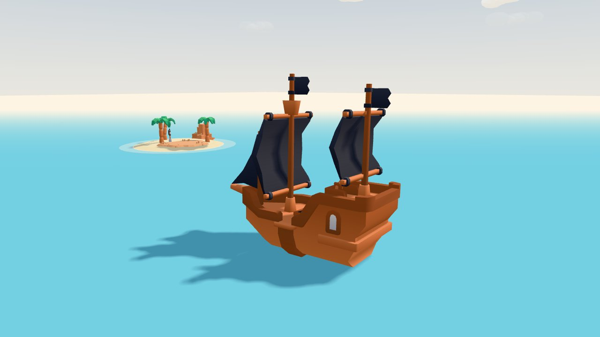

| | |
|---|---|
| 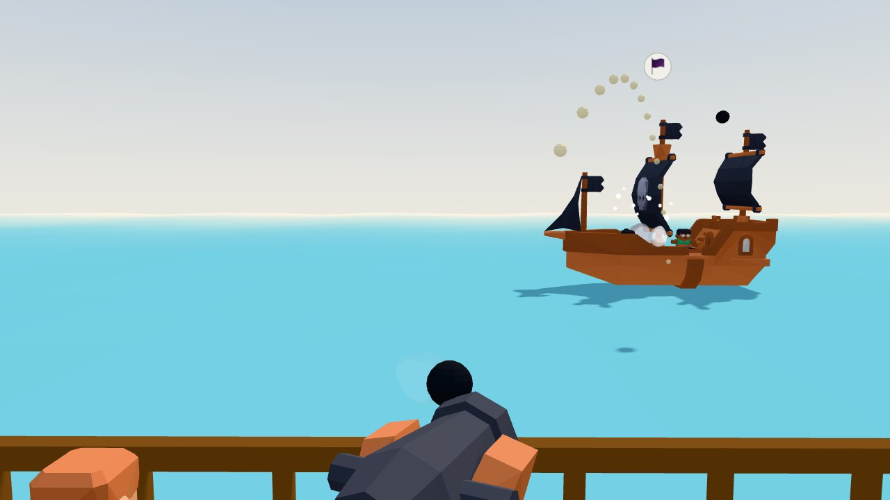 | 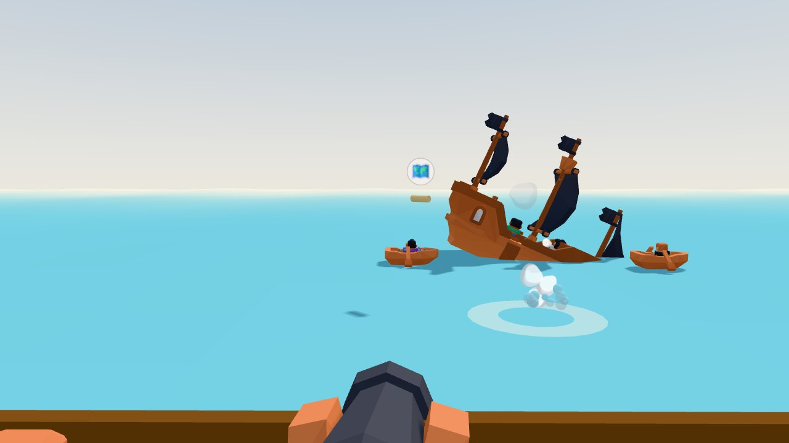 |
| 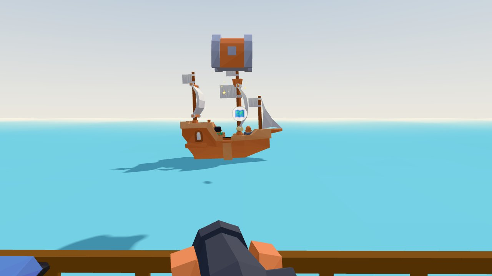 | 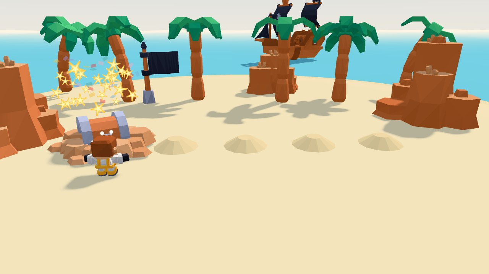 |

**A busy sea, and a solid one.** There are about thirty boats round every
island now instead of nine — sailing boats, tugs, fishing boats, houseboats,
speedboats, cargo ships and ocean liners — on lanes that never let two meet.
The boat no longer sails through things: the pier, the picnic island and its
lighthouse are solid, and running into another boat or the anchored ship
flashes the boat and puts it back on clear water, like the cars.

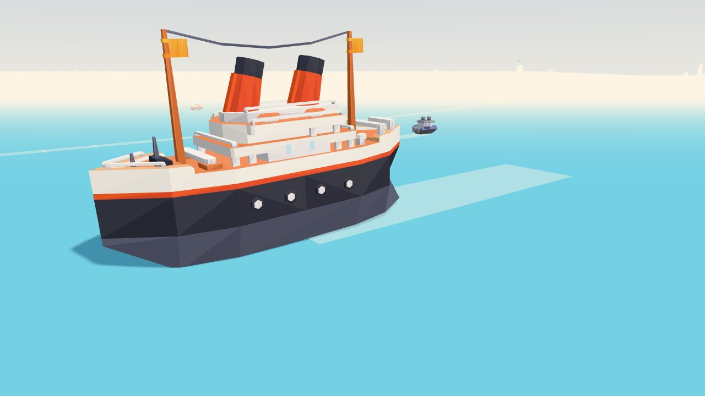

**Trains stop often**, about every 300 m instead of once an island, and the
kid's train starts just before a station, its arrow pointing along the track.
The traffic jams round level crossings are gone, and a new graphics setting
(automatic, low, medium, high) keeps the game smooth on an older computer.

---

## 2026-09-27 — a new garage

The garage got a makeover. Along the bottom is a row of cards, each with a
picture of its vehicle, turned and tucked behind each other like a deck; the
chosen one is big and whole in the middle, pops a little as it arrives there
and gently breathes while it's chosen. The cards glide, growing as they come to
the middle, with a soft tick as each one passes.

Every vehicle stands on a stage of its own — the road vehicles on a street,
the train on rails, the boat in a canal, the helicopters on a helipad, the
plane on a runway, the race cars on a race track — and only the vehicle turns.
The camera measures each one and frames it whole between the title and its
name, whatever its size. Choosing another sends the one there off the way the
cards moved and brings the next one in from the other side (flying ones fly,
the boat sails, the train rolls along its rails), and it arrives with its own
sound: a siren blip, the rotor, the horn, its engine.

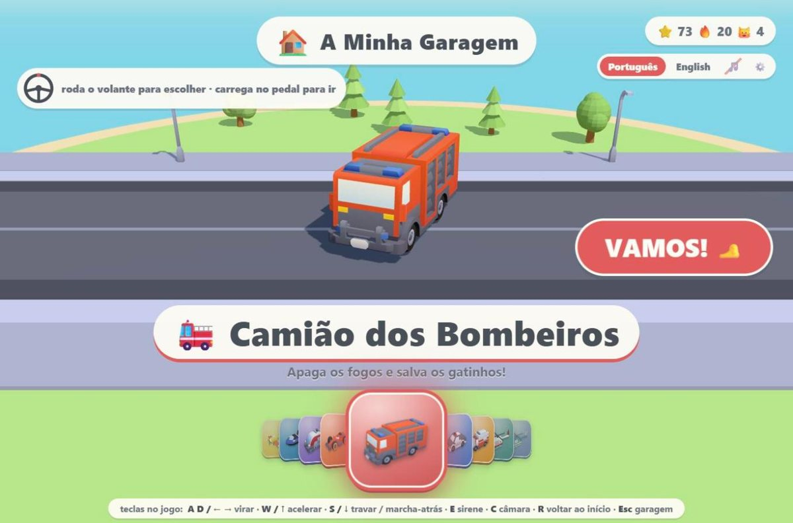

| | |
|---|---|
| 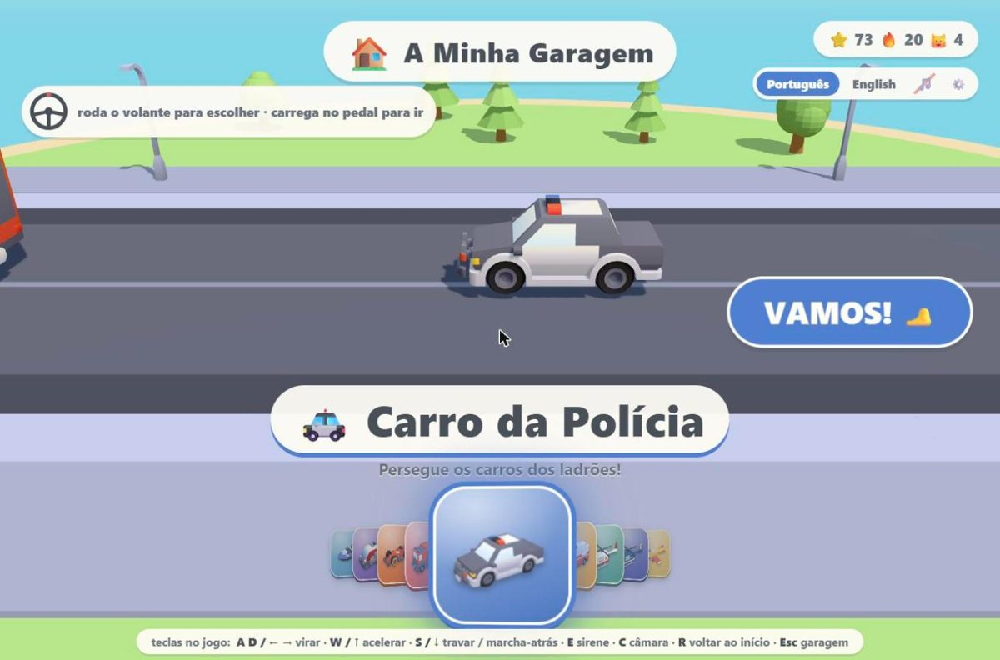 | 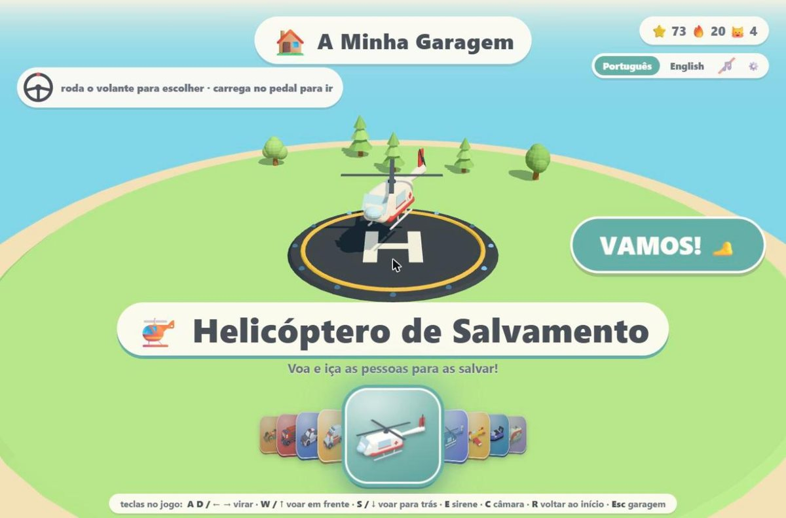 |
| 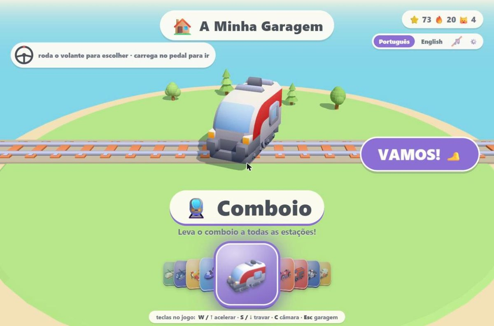 | |

---

## 2026-09-27 — the calls in the city, and every line in Benedita's voice

**The calls show what's wrong.** Driving round the island you can now tell a
call by looking: a building on the corner burning at its windows and roof, a
car or a tree on fire, a cat stuck up a tree, someone hurt sitting on the
pavement. Fires send up a column of smoke you can see over the roofs from
across town, and they crackle as you drive up.

| | |
|---|---|
|  |  |

**Every line in Benedita's voice.** The new lines (a flame flaring up, the cat
moving, the hearts, the chase, "Segura bem!", the train's brake and missed
station) were each recorded in twelve takes and picked by ear. Four of them
were being asked for under the wrong name, so the computer's own (Brazilian)
voice read out the name instead; that is fixed, and a check now makes sure
every line the narrator can say has a recording.

---

## 2026-09-27 — the mission scenes, rebuilt

The mission scenes were the one part of the game still made of grey boxes and
cones on endless grass. Now each is a street built from the city's own kits —
road tiles, pavements, lamps, houses and shops at their real size, trees,
parked cars, people watching behind the tape — with the very house, car or
tree the call showed on fire in the city.

**The games, rethought** (still the wheel only, still impossible to lose):
- **Fire:** a firefighter holds the hose; flames flare up one after another in
  the windows, the roof, the bonnet or the branches, hiss and steam under the
  water, and the last one is a big one.
- **Cat:** drive the ladder truck under the cat — its aerial ladder swings
  round and rises, the cat hops into the basket, rides down and runs to the
  child waiting for it. The cat is playful and changes trees once or twice.
- **Burning building:** the same ladder truck, people waving from balconies.
- **Ambulance:** a stretcher run up the street and back, round cones, puddles
  and a trotting dog, picking up hearts; the ambulance doors swing open.
- **Winch:** a meadow, a rooftop or a swimmer at sea, in a gusty wind.
- **Caught:** a short foot chase across a town square (or the searchlight
  from the police helicopter).

Characters move now (the Kenney characters' own animations: running,
cheering, sitting, waving), crews wear helmets and caps, and the fire, smoke
and water are cartoon effects of their own. In the city every call shows the
real thing: the building on the corner burning under a column of smoke you can
see across town, a burning car or tree, the cat up its tree, someone hurt
sitting on the pavement. New sounds (sizzle, meow, crowd cheer, ladder
hydraulics, winch, footsteps, crackling fire) and new narrator lines.

| | |
|---|---|
|  |  |
|  |  |
|  |  |
|  |  |

---

## 2026-09-27 — a Portuguese voice, music, and a truer city

**A voice from Portugal.** The narrator is now Benedita (ElevenLabs), a
European-Portuguese voice: every line was recorded in several takes and the
best one picked by ear — lines that drifted Brazilian were reworded in turns
only Portugal uses ("estás a ir lindamente", "fugiu-nos", "já falta pouco").
She says a lot more: where a getaway car is ("Está ali à esquerda! Vamos
apanhá-lo!"), "Só falta um! Tu consegues!" on the rings, every overtake in
the race ("Passaste um! Estás em segundo!"), "Quase lá!" halfway through a
mission — and the cheering plays the moment a mission is won, not after.

**Music.** Four tracks for each moment — the garage, the island by day and by
night, the race, the police chase, the missions — played in turn, crossfading,
each a seamless loop of whole bars. The chase tune only starts once a getaway
car is in sight. A ⚙️ panel in the garage sets the voice, music, background
and engine volumes.

**Better sound.** Every race car's engine holds a steady note (the F1's
used to change gear inside its loop); level-crossing bells are heard only
near the crossing; trains sound their horn coming up to one.

**A truer city.**
- Houses, shops and factories stand at their real size, no more tiny "dog
  houses" or stretched sheds; containers are real-size, stacked in rows.
- Nothing is built on a river bridge any more.
- Clouds drift in softly instead of popping out of the sky, and the patrol
  helicopter flies nose first.

**Driving.**
- Higher cameras: the chase view looks down on the street, the high view is
  almost a map.
- The getaway cars drive among the traffic — following it, passing cars that
  pull over for them, waiting their turn at junctions — never through it.
- The train is the kid's to stop: roll past the station and the people waiting
  hop up and down, cross.

| | |
|---|---|
|  |  |
|  | |

---

## 2026-09-26 — day and night, sound and a voice

**Day and night.** A 24-hour clock the kid can see (an hour hand on a
12-hour face, a sun or the moon on it): a game day lasts 12 minutes, every
game starts at 8:00. The sun crosses the sky and sets in orange; at night
the moon rises in its phase (one step further each night), stars twinkle, a
meteor streaks by now and then, and clouds drift overhead. Nights are darker,
never dark.

**The city lights up at night.** Street lamps glow with warm pools on the
road; windows light up one by one at dusk; traffic lights and level-crossing
flashers glow only toward whoever faces them; every car, the trains and the
boats show their lamps; the plane and helicopters their navigation lights; a
lighthouse sweeps its beam over the sea; fireflies dance in the parks;
floodlights ring the race circuit.

**Sound and a voice.** Every vehicle has its own engine sound, each
emergency vehicle its own two-tone siren, and the game's moments their own
jingles, chimes, beeps and bells; cars stuck behind the kid honk; birds by
day, crickets at night, waves by the sea (a 🔊 button turns it all off). A
narrator — Raquel in Portuguese, Cori in English — gives the mission's
briefing, names each new call, cheers every success ("Viva! Ganhaste! És o
campeão!") and encourages after a bump, with feeling and never the same line
twice in a row.

**Two languages.** Everything is in Portuguese (Portugal) by default, or
English, chosen in the garage; the names are spoken aloud.

**Easier to play.**
- A new chunky orange guide arrow, readable from every camera (even
  pointing backwards from the plane), and ahead of the windscreen in the cab
  view.
- Every goal floats the icon of what it is (🔥 🐱 🦹 🏁 ⭕ 🚩 🚉).
- The guide shows a turn early, so there is time to slow down.
- No mission ever starts next to where the game began.
- The minimap is zoomed in and shows only what matters.
- The helicopter climbs over roofs by itself.

**A busier, safer world.**
- People and pets cross the street only on zebra crossings, and the cars
  stop for them.
- Cars wait at level crossings behind the kid; half barriers never trap
  anybody.
- The traffic uses all 12 of the Car Kit's road vehicles.
- The boats sail smoothly.
- The causeways between the islands are always in view.

**More to play.**
- The race has a garage carousel of race cars (F1s, karts, toy racers, a
  monster truck), and the rivals vary.
- Getaway cars dash off when bumped or lit by the searchlight, so a chase
  takes a couple of goes.
- Emergency vehicles flash their own lamps.

| | |
|---|---|
|  |  |
|  |  |
|  |  |
|  |  |
|  |  |

---

## 2026-09-25 — the first README

An endless archipelago of seeded island cities joined by causeways, each
with its own shore, river (crossed on real bridges), two railway lines with
stations and gated level crossings, and districts from downtown towers to
suburbs, parks, forests and rail yards; every tenth island a small race
island that is a whole kart circuit. Cars follow the streets and stop at red
lights and level crossings, people and pets walk the sidewalks, trains run on
a timetable from island to island, boats sail under the causeways.

A garage chosen with the steering wheel opens nine play modes — fire truck,
police car, ambulance, rescue and police helicopters, plane, boat, train and
kart race — and reaching a call opens its mission scene, played with the
wheel alone (the hose, the ladder, the stretcher, the winch).

| | |
|---|---|
|  |  |
|  |  |
|  |  |
|  |  |
